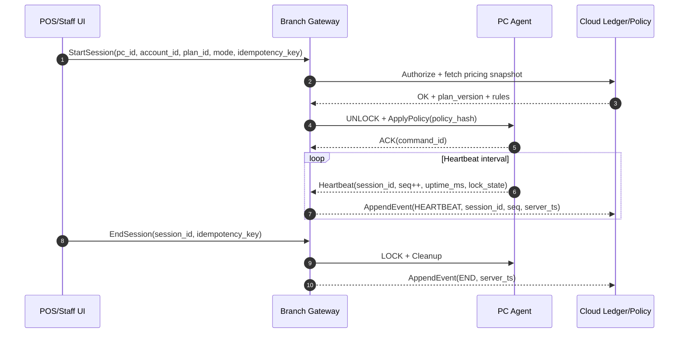
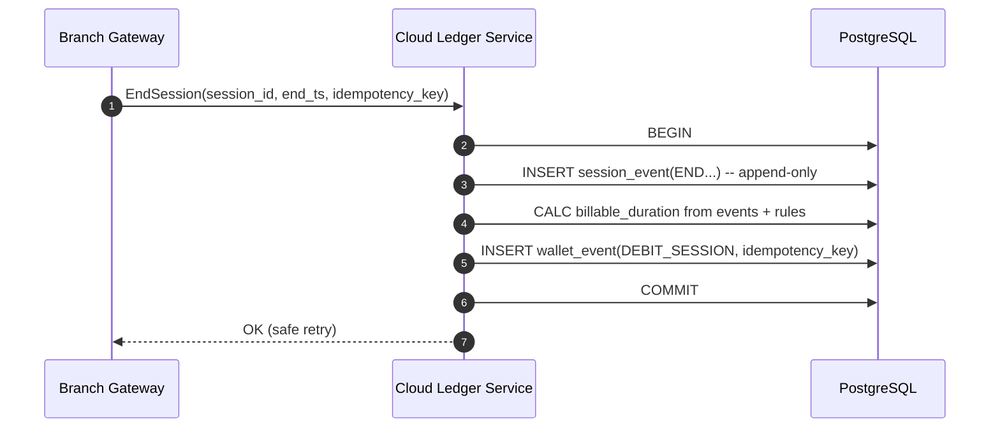
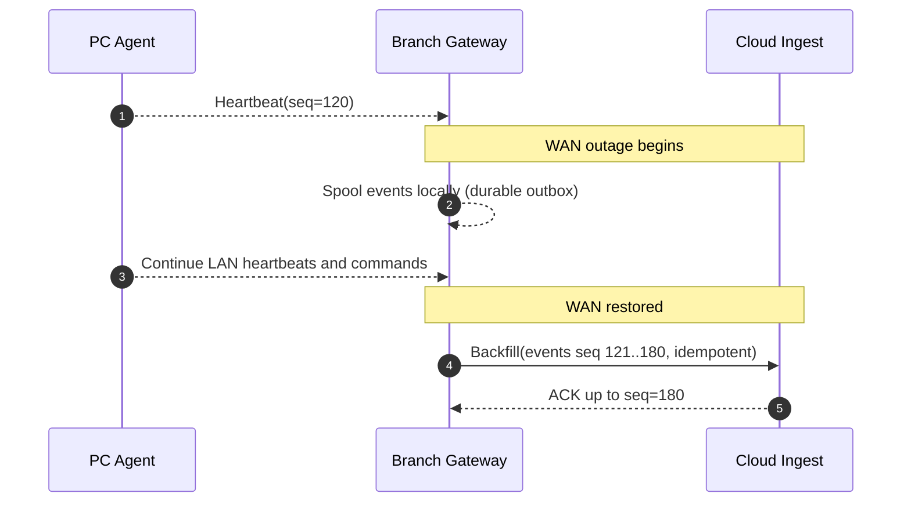

# Enterprise Internet Café and PC‑Gaming Venue Management System Design 2020–2026

## Executive Summary

A production-grade, enterprise internet‑café / PC‑gaming venue management system that scales to **50–500 branches** and **thousands of PCs** is best engineered as two tightly coupled systems: a **real‑time control plane** for endpoint enforcement (lock/unlock, kiosk shell, process/power control) and a **finance-grade ledger plane** for wallets, time-based billing, promotions, refunds, and audit/reconciliation. Vendor systems in this space consistently reflect that separation in practice: Smartlaunch documents explicit “Server / Administrator / Client” modules and a fixed client↔server port for LAN control; SENET emphasizes consolidated chain visibility “in a single interface”; iCafeCloud documents operational workflows for pausing sessions during outages and configurable behavior on power-off/shutdown. citeturn6view0turn2search1turn2search2turn2search6

For enterprise multi-branch scale, the most robust pattern is **hybrid cloud + branch gateway + per‑PC agent**: keep low-latency enforcement and outage continuity at the branch (gateway authority + local cache + durable event spool), while running cross-branch identity, wallet ledger, reporting, and governance in the cloud. This aligns with (a) Smartlaunch’s LAN-first control and “clients continue to run if the server is restarted,” (b) iCafeCloud’s explicit “pause/resume all sessions” outage procedure that preserves billing correctness, and (c) SENET’s chain dashboards accessible centrally. citeturn6view0turn2search2turn2search1

Correctness and fraud resistance require a **ledger-first** design: treat money movements and billable time calculations as **append-only events** with deterministic reconciliation, rather than mutable balances and tick-updated counters. This matches the widely used **Event Sourcing** pattern: append-only event storage provides an audit trail and supports replay into projections, while compensating events (refunds/voids) preserve history. citeturn3search3

Operational cost drivers in gaming venues are dominated less by “billing math” and more by **fleet operations**: game installation/updates, endpoint resets, and minimizing staff time. Vendor docs and marketing emphasize diskless or “update once, propagate widely” mechanisms (e.g., SENET Boot’s “download to server, reboot clients, updates available,” CCBoot’s diskless “wiped clean after reboot,” and Smartlaunch SmartDisk claims of dramatic bandwidth/staff savings at 100 PCs). citeturn7search3turn2search3turn7search18

## Assumptions

This report designs a reference architecture and engineering practices; where vendor-specific internal implementation details are not publicly documented, they are marked **unspecified** and treated as design choices.

Assumptions used:

- Branch count: 50–500; PCs per branch: 10–500; mostly Windows endpoints; LAN connectivity is stable; WAN connectivity can be intermittent. (If OS mix differs, the agent packaging and hardening strategy changes significantly; unspecified.) citeturn6view0  
- Operator model: a single enterprise “chain” (one tenant) is the primary target, but design supports multi-tenant SaaS in the future. citeturn5search15turn5search11  
- Payments: card payments (if present) are processed via a PSP with tokenization; the platform does not store PAN/cardholder data (PCI scope minimization). (Exact PSP, cash drawer integration, and regional compliance rules are unspecified.) citeturn0search3  
- Availability targets: branch enforcement must remain functional during WAN outages; cloud reporting may degrade during outages but must reconcile after restoration. (Exact SLA and error-budget policy are unspecified and should be set by business leadership.) citeturn8search7turn9search5  
- Identity: customers may have per-branch accounts or chain-wide accounts; both are supported by data model. (Whether cross-branch roaming is allowed is a policy choice; unspecified.) citeturn2search1turn2search10  

## Recommended Reference Architecture

### Topology

```mermaid
flowchart TB
  subgraph Cloud["Cloud Control Plane (Multi-Region)"]
    IAM[Identity + RBAC]
    CATALOG[Pricing/Offers Catalog]
    LEDGER[Wallet Ledger + Refunds + Reconciliation]
    BOOK[Reservations/Booking Service]
    AUDIT[Audit Log + Reporting]
    BUS[Event Stream / Message Bus]
    IAM --> AUDIT
    LEDGER --> AUDIT
    BUS --> LEDGER
    BUS --> AUDIT
  end

  subgraph Branch["Branch (10–500 PCs)"]
    GW[Branch Gateway (Edge Authority)\nSession engine + cache + spooler]
    POS[Front Desk / POS Console]
    subgraph PCs["PC Fleet"]
      A1[PC Agent 1\nWindows service + kiosk shell]
      A2[PC Agent 2\nWindows service + kiosk shell]
      AN[PC Agent N\nWindows service + kiosk shell]
    end
    POS --> GW
    GW <--> A1
    GW <--> A2
    GW <--> AN
  end

  GW <--> BUS
  GW <--> IAM
  GW <--> CATALOG
```

**Textual description:**  
The **PC Agent** enforces lock/unlock and workstation restrictions and executes control commands; the **Branch Gateway** is the local authority for real-time session state and offline continuity (cache + durable spool); the **Cloud Control Plane** owns multi-branch identity/RBAC, pricing catalogs, the authoritative event-sourced wallet ledger, and consolidated reporting. This structure generalizes vendor-proven roles (Smartlaunch’s Server/Administrator/Client separation and explicit LAN connection behavior) and multi-location admin patterns (SENET consolidated dashboards and role-based access rights). citeturn6view0turn2search1turn2search5

### Component responsibilities and why the gateway exists

The branch gateway is justified by vendor evidence that outages and restarts are normal operational events and must not stall business operations: Smartlaunch notes clients can continue running if the server is closed/restarted; iCafeCloud provides explicit “pause all sessions” during outages and a policy toggle for whether shutdown ends sessions or lets them continue when powered back on. citeturn6view0turn2search2turn2search6

### Alternative architectures and fit

| Architecture | When it fits | Strengths | Weaknesses |
|---|---|---|---|
| Cloud-only | Small fleets, high WAN reliability, low need for offline continuity | Simplest governance and reporting | WAN outages become operational outages; higher command latency |
| Hybrid (recommended) | 50–500 branches, WAN uncertainty, strong need for correctness | Local continuity + centralized governance; bounded blast radius | More components; requires event backfill discipline |
| Fully local per branch | Strict on-prem constraints, no cloud usage allowed | Maximum local autonomy | Hardest reconciliation; difficult cross-branch identity/wallet |

This tradeoff is consistent with vendor practice: SENET emphasizes cloud-based chain reporting; Smartlaunch documents LAN control and explicit ports; iCafeCloud documents operational pause/resume and shutdown semantics that imply robust local session management under imperfect conditions. citeturn2search1turn6view0turn2search2

## Scaling, Multi-Tenancy, and Multi-Branch Data Topology

### System scaling strategies

**Horizontal scaling in the cloud:** keep most services stateless and scale out with orchestration; use autoscaling controllers to match demand. Kubernetes’ Horizontal Pod Autoscaler (HPA) is explicitly designed to automatically scale workloads (Deployments/StatefulSets) to match demand (horizontal scaling = more Pods). citeturn9search0

**Regionalization:** for 50–500 branches across wide geographies, place cloud control-plane deployments in multiple regions and route each branch to the nearest region. When configured, add “regional relay” endpoints to reduce cross-ocean latency and reduce the blast radius of a regional outage. (Vendor implementation details here are unspecified; SENET’s cloud provider note indicates cloud hosting, but exact topology is not detailed publicly.) citeturn7search5turn2search1

**Sharding/partitioning:** treat high‑volume tables (session events, telemetry, audit logs, wallet events) as partitioned by time and/or tenant, and consider sharding when single-cluster Postgres saturates. PostgreSQL declarative partitioning supports range/list/hash strategies and is a standard approach to managing large tables and retention. citeturn9search2turn9search22

### Multi-tenant models and recommended choice

Azure’s multitenant guidance and SaaS tenancy patterns describe the canonical tradeoffs among **shared DB**, **schema-per-tenant**, and **DB-per-tenant**, and explicitly note DB-per-tenant simplifies tenant-specific customization but increases operational complexity at scale. citeturn5search15turn5search11

**Recommended enterprise baseline:** shared database with `tenant_id` + strict access controls, with the ability to graduate to sharding by tenant (or tenant+region) when needed.

| Tenancy model | Operational fit | Isolation | Complexity | Typical use in this system |
|---|---|---|---|---|
| Shared DB (`tenant_id`) | Best for many tenants and fast iteration | Moderate | Lowest | Default for SaaS-control-plane OLTP |
| Schema per tenant | Good for moderate tenant counts | High logical | Medium | For premium tenants with custom schema needs |
| DB per tenant | Best for strict isolation | Highest | Highest | For regulated/high-value tenants; backup/restore per tenant |

This table reflects the design patterns discussed in Azure tenancy guidance. citeturn5search11turn5search15

### Capacity planning guidance for 50–500 branches

Capacity sizing is dominated by **agent heartbeats and session state changes**, not operator UI.

Let:
- `P` = online PCs across all branches  
- `S` = active sessions (≤ P)  
- `h` = heartbeat interval seconds  
- `E` = average event rate per active session (state changes + heartbeats)

Then heartbeat ingress is ~`S / h` messages per second before compression.

To avoid overloading the cloud ingest path during reconnect storms, aggregate at the branch gateway and separate “control plane” commands from heavy telemetry payloads (screenshots/process lists). A vendor example of this separation exists: TrueCafe release notes mention a separate network channel for terminal data (screenshots/process list), reducing interference with core control traffic. citeturn2search7

### Partitioning and indexing strategy

Use partitioning for:
- `session_event` by time (monthly or weekly partitions), optionally sub-partitioned by tenant. PostgreSQL supports range/list/hash partitioning; partition pruning improves performance when queries filter by partition keys. citeturn9search2turn9search22  
- `audit_event` by time and tenant to support both retention and “append-only audit” requirements. OWASP recommends tamper detection and copying logs to read-only media soon, and OWASP Top 10 recommends append-only audit trails for high-value transactions. citeturn4search1turn4search5  

Use multicolumn indexes where query shapes are stable; PostgreSQL’s multicolumn index documentation describes that a multicolumn B-tree can be used with subsets of columns but is most efficient when aligned with query patterns. citeturn9search22

## Correctness, Reliability, and Real-Time Billing

### Offline branch mode and event spool/backfill

iCafeCloud’s operational wiki explicitly documents a first-class “Pause all sessions” function for internet/power outages, demonstrating that outages are normal and billing must remain correct under pause/resume. citeturn2search2

**Recommended reliability pattern:**
- Branch gateway writes all state transitions to a local durable store (“spool”), continues enforcing sessions in offline mode, and later backfills to the cloud.
- Cloud ingests backfill events using idempotency keys and sequence numbers, tolerating duplicates and out-of-order delivery.

To reliably publish events without distributed transactions, use the **Transactional Outbox** pattern: update business entities and record outgoing events in the same database transaction; later a publisher ships outbox rows to the message broker. citeturn4search0turn4search4

### Idempotency, reconciliation, and integrity

For money and session state, assume retries and duplicates are normal; design all externally visible “state-changing” APIs as idempotent.

entity["company","Stripe","payments api provider"]’s API documentation explains idempotency keys enable safe retries without accidentally performing the same operation twice; POST requests accept idempotency keys for that purpose. citeturn8search0turn8search4

**Enterprise recommendation:** require an `idempotency_key` for:
- start/end session
- wallet topup/refund/adjustment
- promotion application
- POS sale commit and reversal

### Database design with concrete PostgreSQL schemas

The schema below illustrates an **append-only wallet ledger**, a **session table**, and **append-only session events** (event-sourced). The design is consistent with the Event Sourcing pattern recommendation: append-only events provide an audit trail, support replay into projections, and use compensating events for reversals. citeturn3search3

```sql
-- Tenant and branch identity
CREATE TABLE tenant (
  tenant_id uuid PRIMARY KEY,
  name text NOT NULL,
  created_at timestamptz NOT NULL DEFAULT now()
);

CREATE TABLE branch (
  branch_id uuid PRIMARY KEY,
  tenant_id uuid NOT NULL REFERENCES tenant(tenant_id),
  name text NOT NULL,
  timezone text NOT NULL,
  region text NULL,
  created_at timestamptz NOT NULL DEFAULT now()
);

-- Customer accounts (optional chain-wide identity)
CREATE TABLE account (
  account_id uuid PRIMARY KEY,
  tenant_id uuid NOT NULL REFERENCES tenant(tenant_id),
  external_id text NULL,
  display_name text NOT NULL,
  status text NOT NULL CHECK (status IN ('active','suspended','closed')),
  created_at timestamptz NOT NULL DEFAULT now()
);

-- Append-only wallet ledger
CREATE TABLE wallet_event (
  tenant_id uuid NOT NULL,
  wallet_event_id uuid NOT NULL,
  account_id uuid NOT NULL REFERENCES account(account_id),
  branch_id uuid NULL REFERENCES branch(branch_id),
  event_type text NOT NULL CHECK (event_type IN
    ('TOPUP','DEBIT_SESSION','REFUND','PROMO_CREDIT','ADJUSTMENT')),
  currency char(3) NOT NULL,
  amount_cents bigint NOT NULL,            -- signed: credit positive, debit negative
  related_session_id uuid NULL,
  related_sale_id uuid NULL,
  idempotency_key text NOT NULL,
  created_at timestamptz NOT NULL DEFAULT now(),
  created_by_staff_id uuid NULL,
  metadata jsonb NOT NULL DEFAULT '{}'::jsonb,
  PRIMARY KEY (tenant_id, wallet_event_id)
);

CREATE UNIQUE INDEX ux_wallet_idempotency
  ON wallet_event(tenant_id, idempotency_key);

CREATE INDEX ix_wallet_account_time
  ON wallet_event(tenant_id, account_id, created_at DESC);

-- Sessions: current state + pointers; bill computed from events for correctness
CREATE TABLE session (
  tenant_id uuid NOT NULL,
  session_id uuid NOT NULL,
  branch_id uuid NOT NULL REFERENCES branch(branch_id),
  pc_id text NOT NULL,                     -- stable workstation identity
  account_id uuid NULL REFERENCES account(account_id),
  billing_mode text NOT NULL CHECK (billing_mode IN ('PREPAID','POSTPAID','FREE','STAFF')),
  plan_id text NOT NULL,
  plan_version bigint NOT NULL,
  start_ts timestamptz NOT NULL,
  end_ts timestamptz NULL,
  state text NOT NULL CHECK (state IN ('ACTIVE','PAUSED','ENDED','SUSPECT')),
  last_seq bigint NOT NULL DEFAULT 0,
  created_at timestamptz NOT NULL DEFAULT now(),
  PRIMARY KEY (tenant_id, session_id)
);

CREATE INDEX ix_session_branch_state
  ON session(tenant_id, branch_id, state);

-- Append-only session events (partition by time in production)
CREATE TABLE session_event (
  tenant_id uuid NOT NULL,
  session_id uuid NOT NULL,
  seq bigint NOT NULL,
  event_type text NOT NULL CHECK (event_type IN
    ('START','HEARTBEAT','PAUSE','RESUME','END','POWER_LOSS','RECONNECT')),
  server_ts timestamptz NOT NULL,
  agent_uptime_ms bigint NULL,
  payload jsonb NOT NULL DEFAULT '{}'::jsonb,
  PRIMARY KEY (tenant_id, session_id, seq)
);
```

**Partitioning and retention:** implement `session_event` (and high-volume `wallet_event` in very large deployments) as declaratively partitioned tables by time (range) and optionally by tenant. PostgreSQL supports declarative partitioning and is designed for range/list/hash strategies. citeturn9search2turn9search22

**PITR requirements:** PostgreSQL describes point-in-time recovery using continuous WAL archiving plus base backups; WAL replay permits restoring to a target time. citeturn1search3turn1search20

### Example reconciliation queries

Wallet balance at time `T`:

```sql
SELECT currency, SUM(amount_cents) AS balance_cents
FROM wallet_event
WHERE tenant_id = $1 AND account_id = $2 AND created_at <= $3
GROUP BY currency;
```

Detect duplicate session debits (should be impossible if idempotency is correctly enforced):

```sql
SELECT related_session_id, COUNT(*) AS debit_count
FROM wallet_event
WHERE tenant_id = $1 AND event_type = 'DEBIT_SESSION'
GROUP BY related_session_id
HAVING COUNT(*) > 1;
```

These queries operationalize “append-only auditability” and support investigation of anomalies that OWASP flags as critical for high-value transactions. citeturn4search5turn4search1

### Real-time communication design and time sync

**Protocol selection must account for NAT/firewall traversal and keepalive controls.** WebSocket is TCP-based with an HTTP Upgrade handshake and defaults to ports 80/443, making it compatible with common firewall/proxy policies. citeturn0search4

**gRPC streaming** uses HTTP/2 and has explicit keepalive guidance; the gRPC keepalive guide describes HTTP/2 PING-based keepalives and warns to configure intervals carefully. citeturn0search1turn0search5

**MQTT** defines a Keep Alive field in CONNECT and provides a broker-mediated model useful for telemetry and command fanout. citeturn1search0turn1search14

**Custom TCP** can work well for LAN agent↔gateway but is typically harder for WAN and enterprise firewalls. Smartlaunch’s LAN-first model explicitly documents a client port (7831) and instructs opening that port in firewalls between clients and server. citeturn6view0

**Recommended selection:**
- Agent↔Gateway (LAN): gRPC bi-di streaming or WebSocket; both allow persistent connections, heartbeats, and fast control. citeturn0search4turn0search1  
- Gateway↔Cloud (WAN): gRPC streaming (typed APIs + keepalive) or WebSocket over 443; include strict backpressure and retry policies. citeturn0search1turn0search4  
- Telemetry/event pipeline: a durable stream/bus to absorb bursts and support backfill. (Specific bus choice is a technology decision; examples provided below.) citeturn4search0turn3search3  

**Time synchronization:** billable time must be computed from **server-authoritative timestamps**. NTP is widely used to synchronize clocks and is standardized in NTPv4 (RFC 5905). citeturn0search2turn0search6

### Message envelope and sequencing

A robust command/event model uses:
- `command_id` (UUID) + `idempotency_key`
- per-session monotonic `seq`
- `server_ts` assigned by gateway (authoritative time)
- optional `agent_uptime_ms` (monotonic clock hint)

Example JSON command envelope:

```json
{
  "tenant_id": "…",
  "branch_id": "…",
  "pc_id": "PC-042",
  "command_id": "b7f2c1b6-…",
  "idempotency_key": "b7f2c1b6-…",
  "type": "UNLOCK",
  "policy_hash": "sha256:…",
  "issued_at": "2026-02-17T10:01:02Z",
  "expires_at": "2026-02-17T10:01:12Z"
}
```

The idempotency requirement is justified by payments-grade retry expectations: idempotency keys allow safe retries and prevent duplicate operations. citeturn8search0turn8search4

### Time-based billing logic and edge-case recovery

**Session start/stop rules:** support walk-ins (start at unlock) and reservations (start at assigned time or at first login). ggLeap’s materials emphasize venue booking/reservations and availability-based booking flows, indicating that reservation logic is a first-class feature in the space. citeturn3search1

**Billing algorithms:**  
- Continuous: compute charge once from `(end_ts - billable_start_ts)` with final rounding.  
- Tick-based: debit in discrete intervals (e.g., 60s) for prepaid UX; requires strict idempotency and monotonic sequencing to prevent double-debits.

**Promotions, packs, and credit limits:** Smartlaunch documents “day/night/tournament packs” and a “credit limit” for Play & Pay that triggers logout once exceeded, illustrating domain requirements for pricing-pack logic and enforced cutoffs. citeturn7search0turn7search7

**Outage and power loss recovery:** iCafeCloud documents a specific operational algorithm: pausing sessions during outages so time/cost are put on hold, then resuming; it also documents policy control for whether shutdown triggers automatic checkout or keeps session running to continue after power-on. citeturn2search2turn2search6

#### Mermaids for lifecycle, billing, and recovery

Session lifecycle (intent → enforcement → durable events):



Billing deduction (postpaid; ledger-based; idempotent):



Failure recovery after WAN disconnect (branch offline spool + backfill):



**Textual interpretation:** these sequences enforce correctness by (a) treating the gateway clock as authoritative (NTP-synced), (b) making all commits idempotent, and (c) preserving an append-only event trail for reconciliation. This is consistent with event sourcing guidance on audit trails and replay, NTP standardization, and idempotency guidance for safe retries. citeturn3search3turn0search2turn8search0

### Conflict resolution strategies at scale

- **Event sourcing (recommended for ledger and billing):** authoritative append-only events with projections avoids “merge conflicts” on money state; compensating events preserve history. citeturn3search3  
- **CRDTs (selective use):** for non-financial replicated counters or sets (e.g., aggregated playtime counters per title), CRDTs provide strong eventual consistency under concurrent updates and failures (formalized by Shapiro et al.). Financial state should not be “CRDT-merged.” citeturn5search2  
- **Last-write-wins:** acceptable only for low-stakes configuration toggles with explicit versioning; not acceptable for money movement.

## Security, Operations, Tech Stack, Testing, and Cost Drivers

### Endpoint security and anti-bypass

**User-mode hardening should be the default.** entity["company","Microsoft","windows and cloud vendor"] documents Shell Launcher as a Windows feature to replace Explorer.exe with a desktop app/UWP app for kiosk-like devices, and also documents kiosk configuration options (Assigned Access) for restricted user experiences. citeturn4search2turn4search6

**Allowlisting:** Microsoft documentation for Application Control / WDAC states that in enforcement mode only trusted applications are allowed to run; this is a strong baseline defense against “run random EXE” bypass attempts. citeturn4search3turn4search7

**Kernel vs user-mode tradeoff:** kernel-mode protections can harden input blocking and tamper resistance but incur high operational burden. Microsoft’s driver signing policy notes that starting with Windows 10 version 1607, Windows will not load new kernel-mode drivers that are not signed via the Dev Portal (with program registration and EV certificate requirements). citeturn5search0turn5search6

**Secure Boot:** Microsoft documentation (and Microsoft support guidance) explains Secure Boot helps prevent malicious software from loading during boot by allowing only trusted, digitally signed software; Trusted Boot extends protections into OS startup. citeturn5search1turn5search7

### Encrypted channels, RBAC, tamper detection, and audit

- Encrypt all agent/gateway/cloud channels (TLS). WebSocket over TLS defaults to 443; gRPC uses HTTP/2 over TLS in common deployments. citeturn0search4turn0search1  
- Implement RBAC with roles and groups similar to SENET’s documented admin access rights model (roles linked to groups, groups assigned to employees). citeturn2search5turn2search1  
- Audit immutably: OWASP recommends tamper detection and storing/copying logs to read-only media as soon as possible; OWASP Top 10 recommends append-only audit trails for high-value transactions. citeturn4search1turn4search5  

### PCI DSS and payment workflows

PCI DSS is published by the PCI Security Standards Council and provides baseline technical/operational requirements to protect payment account data. Architecturally, reduce scope by keeping card data out of the venue system (PSP-hosted checkout/tokenization) and only recording internal ledger events for topups/refunds. citeturn0search3turn0search7

### Observability, SLOs/SLA examples, and incident response

OpenTelemetry describes itself as a vendor-neutral observability framework for generating, collecting, and exporting telemetry (traces, metrics, logs). Use it across cloud services and (where feasible) gateways; on Windows agents, emit structured events and gateway-side correlation IDs. citeturn1search1turn1search15

SLO practice: Google’s SRE guidance explains SLOs imply an error budget and that the SLO violation rate can be managed against that budget to govern rollout frequency. citeturn8search7turn8search3

Illustrative SLOs for this domain:
- **Session enforcement:** 99.95% of lock/unlock commands applied within 2 seconds on LAN per week (measured at gateway).  
- **Ledger correctness:** 99.999% of sessions reconcile to exactly one final debit (or compensating refund) and match shift closeout totals.  
- **Backfill durability:** 99.99% of offline-spooled events eventually land in cloud within 15 minutes of WAN restoration.

(Exact SLO targets are business choices; the “error budget” concept is from Google SRE.) citeturn8search7turn8search11

### Disaster recovery patterns, RPO/RTO targets, backups, PITR

entity["company","Amazon Web Services","cloud provider"] publishes DR strategy guidance (backup/restore, pilot light, warm standby, multi-site active/active) and explicitly connects strategy choice to RPO/RTO and cost. AWS Well-Architected references point-in-time recovery lowering RPO (in some cases) to minutes; AWS DR whitepapers enumerate strategy options. citeturn9search5turn9search1turn9search12turn9search3

PostgreSQL’s documentation describes continuous archiving and PITR via replay of archived WAL plus base backups. citeturn1search3turn1search20

Recommended targets (typical for revenue systems; tailor to business):
- Branch gateway RTO: minutes (local restart; clients reconnect; sessions recover).  
- Cloud ledger RPO: minutes or less (synchronous replication + PITR).  
- Cloud RTO: hours for full regional outage if using warm standby; lower if active/active. citeturn9search5turn9search3turn1search3

### Deployment models and rollout strategies

Kubernetes documentation describes rolling updates as incremental Pod replacement aiming for zero downtime; this is the default deployment approach for stateless services. citeturn1search2turn1search6

Microsoft Azure’s blue/green guidance describes validating a “green” environment and switching traffic via routing changes to increase availability during upgrades. citeturn8search1turn8search9

Argo Rollouts documentation defines canary rollouts as releasing to a small percentage of production traffic first; this is particularly valuable for ledger services where regressions are expensive. citeturn8search2

### Fleet operations and diskless imaging cost drivers

Game updates and “clean state” endpoints are major cost drivers. Vendor evidence:
- SENET Boot: install/update content on a server, reboot clients, updates become available across PCs in minutes. citeturn7search3turn7search9  
- CCBoot: diskless boot system; PCs are “wiped clean” each reboot, helping with malware persistence and reducing per-PC remediation. citeturn2search3turn2search7  
- Smartlaunch SmartDisk: marketing claims major reductions in bandwidth and staff update work for a 100-computer venue (treat as vendor claim; validate in pilots). citeturn7search18turn7search1  

A practical enterprise pattern is: integrate a diskless/update subsystem as an “ops layer,” while keeping session/ledger logic independent so the business can swap imaging tooling without rewriting billing. citeturn7search9turn2search7

### Tables of tradeoffs

**Protocols for persistent control and telemetry**

| Protocol | Best use in this system | Keepalive/liveness | Strengths | Risks |
|---|---|---|---|---|
| WebSocket | Agent↔gateway or gateway↔cloud over 443 | Ping/Pong frames; app heartbeats | Firewall-friendly defaults (80/443); full duplex | Backpressure requires care; message framing is app-defined |
| gRPC streaming | Gateway↔cloud; also agent↔gateway | HTTP/2 PING keepalives | Strong typing; efficient multiplexing | Keepalive tuning required across LBs |
| MQTT | Telemetry fanout; command pub/sub | CONNECT Keep Alive | Lightweight; broker persistence options | Broker adds complexity; strict request/response needs extra design |
| Custom TCP | LAN agent↔gateway only | Custom keepalive | Low overhead | Hard across restrictive networks; fewer ecosystem tools |

This summary is derived from protocol specs and keepalive guidance. citeturn0search4turn0search1turn1search0

**Database roles: OLTP vs analytics vs cache**

| Data need | Recommended store | Why | Source basis |
|---|---|---|---|
| Wallet ledger + sessions (OLTP) | PostgreSQL | ACID, strong correctness; PITR via WAL | PostgreSQL PITR/WAL docs citeturn1search3turn1search20 |
| High-volume analytics | ClickHouse (optional) | Columnar OLAP for fast analytic queries | ClickHouse describes itself as column-oriented OLAP DBMS citeturn10search11turn10search15 |
| Low-latency caching | Redis (optional) | In-memory + optional persistence modes | Redis persistence docs citeturn10search1turn10search21 |

### Concrete tech-stack recommendation and final suggested stack

This stack is chosen to align with the system’s two core needs: (a) correctness and auditability for money flows, and (b) low-latency, resilient control of a large PC fleet.

**Cloud control plane (recommended):**
- Stateless microservices (Go/Java/.NET are all viable; language choice is unspecified and should match team skill).  
- PostgreSQL for OLTP ledger and session state; partition large event tables; PITR enabled via WAL archiving. citeturn1search3turn9search2  
- Event stream/message bus: Apache Kafka (strong partitioning model) or NATS JetStream. Kafka documentation highlights partitioned topics; JetStream documentation highlights persistence and replay, enabling fault-tolerant streaming. citeturn10search0turn10search2  
- Observability: OpenTelemetry SDKs/Collector; export to your chosen backend. citeturn1search1turn1search15  
- Orchestration: Kubernetes with rolling updates, plus blue/green for higher-risk changes and canary rollouts for ledger services. citeturn1search2turn8search1turn8search2  

**Branch gateway (recommended):**
- Linux or Windows service running a persistent control server with: local cache, durable outbox/spool DB (PostgreSQL or SQLite), and reconnect storm handling.  
- Transactional Outbox pattern for publishing spooled events to the cloud bus after WAN restoration. citeturn4search0turn4search4  

**PC agent (recommended):**
- Windows service + controlled UI shell. Use Shell Launcher or Assigned Access kiosk configurations; enforce WDAC/AppLocker allowlisting policies; avoid kernel drivers unless needed for specific bypass scenarios due to signing burden. citeturn4search2turn4search3turn5search0turn5search7  

**Vendor-proven operational integrations (optional):**
- Diskless imaging/update toolchain (SENET Boot / CCBoot / similar) to reduce update labor and improve endpoint freshness, with clear separation from billing logic. citeturn7search9turn2search7  

### Testing strategies

A venue system must be tested under partitions and restarts because vendors explicitly document pause/resume outage operations and server restarts during peak hours:
- Partition testing: WAN down, LAN up; verify offline enforcement and later backfill correctness. citeturn2search2turn4search0  
- Power-loss testing: shutdown mid-session; verify configured “auto checkout vs resume” behavior. citeturn2search6  
- Idempotency regression tests: repeated EndSession/Refund/TopUp with same idempotency keys must not duplicate effects. citeturn8search0  
- Replay tests: rebuild projections from event logs to validate reconciliations (event sourcing benefit). citeturn3search3  

## Prioritized Sources

### Primary vendor documentation and case-study style sources

- Smartlaunch installation architecture (Server/Administrator/Client), client port 7831, unique workstation numbers, and “client continues to run if server is closed.” citeturn6view0turn6view1  
- Smartlaunch billing patterns: packs (day/night/tournament) and credit limit forcing logout for Play & Pay. citeturn7search0turn7search7  
- Smartlaunch pricing and SmartDisk operational claims for high-PC venues. citeturn7search1turn7search18  
- SENET chain reporting: “see information about all locations in a single interface,” plus franchising royalty reports. citeturn2search1  
- SENET admin-panel access rights: roles and groups. citeturn2search5  
- SENET pricing FAQ indicating cloud service based on entity["company","DigitalOcean","cloud provider"]. citeturn7search5  
- iCafeCloud outage handling (“Pause all sessions”) and shutdown policy (“auto checkout when shutdown”). citeturn2search2turn2search6  
- CCBoot diskless model and “wiped clean after reboot,” and “update all PCs with a single click” press materials. citeturn2search3turn2search7  
- SENET Boot diskless update model: download to server, reboot clients, updates available quickly. citeturn7search3turn7search9  
- Antamedia one-time license tiers and feature summaries (pricing and Play & Pay / security controls). citeturn3search0turn3search4  
- ggLeap booking/reservation patterns (booking system for reserving PCs). citeturn3search1  
- CyberCafePro baseline endpoint controls and POS/security positioning. citeturn3search2turn3search13  

### Standards and authoritative engineering guidance

- WebSocket protocol defaults (ports 80/443), TCP-based, HTTP Upgrade handshake. citeturn0search4  
- gRPC keepalive guidance (HTTP/2 PING) and keepalive behavior. citeturn0search1turn0search5  
- MQTT 5.0 spec (CONNECT includes Keep Alive), plus MQTT RFC for PINGREQ/PINGRESP. citeturn1search0turn1search14  
- NTPv4 specification (RFC 5905). citeturn0search2turn0search6  
- PCI DSS overview and document library. citeturn0search3turn0search7  
- OpenTelemetry framework overview. citeturn1search1turn1search15  
- Kubernetes rolling updates and HPA autoscaling. citeturn1search2turn9search0  
- PostgreSQL partitioning and PITR/WAL documentation. citeturn9search2turn1search3turn1search20  
- Event Sourcing pattern (append-only events + audit trail + replay), Transactional Outbox pattern. citeturn3search3turn4search0  
- CRDT formalization (Shapiro et al. 2011) for non-financial conflict-free convergence. citeturn5search2  
- OWASP logging guidance and Top 10 audit-trail recommendations. citeturn4search1turn4search5  
- Blue/green and canary deployment references. citeturn8search1turn8search2  
- DR strategy options and RPO/RTO framing from entity["company","Amazon Web Services","cloud provider"] publications. citeturn9search1turn9search5turn9search12turn9search3  
- SLO/error budget guidance from entity["company","Google","sre publisher"] SRE materials. citeturn8search7turn8search3