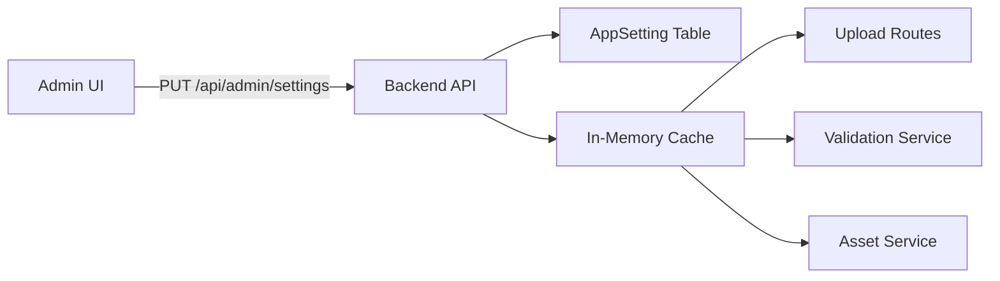

# Admin-Configurable Upload Validation Settings

## Зорилго

Хэрэглэгчийн upload зургийн validation-г admin panel-аас **turn on/off** хийх, мөн upload family тус бүрийн constraints (max size, min DPI, min dimensions, allowed types) динамикаар өөрчлөх боломжтой хуудас нэмэх.

## Одоогийн Байдал

Upload validation constraints **2 газарт hardcoded** байна:
- `backend/src/routes/uploads.ts` — `UPLOAD_FAMILY_CONSTRAINTS` (мөр 29-69)
- `backend/src/services/upload-validation.service.ts` — `UPLOAD_FAMILY_CONSTRAINTS` (мөр 30-62)
- `backend/src/services/asset.service.ts` — `MAX_DESIGN_FILE_SIZE_BYTES`, `allowedDesignMimeTypes` (мөр 6-15)

DB-д тохиргоо хадгалах model **байхгүй**.

## Architecture Pattern



> [!IMPORTANT]
> **Key-Value `AppSetting` model** ашиглана — upload constraint бүрийг тусдаа row-д хадгална. In-memory cache-тэй (5 мин TTL), invalidate on update.

## Proposed Changes

---

### 1. Database — Prisma Schema

#### [NEW] `AppSetting` model in [schema.prisma](file:///d:/Programs/ecommerce-platform/backend/prisma/schema.prisma)

```prisma
model AppSetting {
  id        String   @id @default(uuid())
  key       String   @unique          // e.g. "upload.gang_upload.maxBytes"
  value     Json                       // flexible value storage
  category  String   @default("general") // "upload_validation", "general"
  updatedBy String?                    // admin userId
  updatedAt DateTime @updatedAt
  createdAt DateTime @default(now())

  @@index([category])
  @@map("app_settings")
}
```

**Seed data (14 rows):**

| key | value | category |
|-----|-------|----------|
| `upload.validation.enabled` | `true` | `upload_validation` |
| `upload.gang_upload.enabled` | `true` | `upload_validation` |
| `upload.gang_upload.maxBytes` | `52428800` | `upload_validation` |
| `upload.gang_upload.minDpi` | `150` | `upload_validation` |
| `upload.gang_upload.minWidthPx` | `1200` | `upload_validation` |
| `upload.gang_upload.allowedTypes` | `["image/png","image/jpeg","application/pdf"]` | `upload_validation` |
| ... (same pattern for `uv_gang_upload`, `by_size`, `uv_by_size`, `blanks`) | ... | ... |

---

### 2. Backend — Settings Service

#### [NEW] [settings.service.ts](file:///d:/Programs/ecommerce-platform/backend/src/services/settings.service.ts)

```typescript
// In-memory cache with 5-min TTL
// getUploadConstraints(family) → reads from DB/cache
// getGlobalValidationEnabled() → master on/off toggle
// updateSetting(key, value, adminId) → update + invalidate cache
```

---

### 3. Backend — Admin API

#### [NEW] [settings.ts](file:///d:/Programs/ecommerce-platform/backend/src/routes/admin/settings.ts)

| Method | Endpoint | Description |
|--------|----------|-------------|
| `GET` | `/api/admin/settings?category=upload_validation` | Бүх upload тохиргоо авах |
| `PUT` | `/api/admin/settings/:key` | Нэг тохиргоо шинэчлэх |
| `PUT` | `/api/admin/settings/batch` | Олон тохиргоо нэг удаа хадгалах |

---

### 4. Backend — Refactor Hardcoded Constraints

#### [MODIFY] [uploads.ts](file:///d:/Programs/ecommerce-platform/backend/src/routes/uploads.ts)

- `UPLOAD_FAMILY_CONSTRAINTS` hardcoded объектыг `settingsService.getUploadConstraints(family)` дуудлагаар солих

#### [MODIFY] [upload-validation.service.ts](file:///d:/Programs/ecommerce-platform/backend/src/services/upload-validation.service.ts)

- `UPLOAD_FAMILY_CONSTRAINTS` → `settingsService` руу шилжүүлэх

#### [MODIFY] [asset.service.ts](file:///d:/Programs/ecommerce-platform/backend/src/services/asset.service.ts)

- `MAX_DESIGN_FILE_SIZE_BYTES`, `allowedDesignMimeTypes` → `settingsService` руу шилжүүлэх

---

### 5. Admin Panel UI

#### [NEW] [UploadValidationSettingsPage.tsx](file:///d:/Programs/ecommerce-platform/apps/admin/src/pages/UploadValidationSettingsPage.tsx)

**Layout:** Existing Card-based pattern (matches `SettingsPage.tsx`)

```
┌──────────────────────────────────────────────────┐
│  📤 Upload Validation Settings                    │
├──────────────────────────────────────────────────┤
│  🔘 Global Validation: [ON/OFF toggle]           │
├──────────────────────────────────────────────────┤
│  ┌──── Gang Upload ───────────────────────────┐  │
│  │ 🔘 Enabled: [ON]                           │  │
│  │ Max Size: [50] MB                          │  │
│  │ Min DPI: [150]                             │  │
│  │ Min Width: [1200] px                       │  │
│  │ Types: [PNG] [JPEG] [PDF]                  │  │
│  └────────────────────────────────────────────┘  │
│  ┌──── UV Gang Upload ────────────────────────┐  │
│  │ (same layout)                              │  │
│  └────────────────────────────────────────────┘  │
│  ┌──── By Size ───────────────────────────────┐  │
│  │ (same layout)                              │  │
│  └────────────────────────────────────────────┘  │
│           [ 💾 Save All Changes ]                │
└──────────────────────────────────────────────────┘
```

#### [MODIFY] [App.tsx](file:///d:/Programs/ecommerce-platform/apps/admin/src/App.tsx)

- `/upload-settings` route нэмэх

#### [MODIFY] [Sidebar.tsx](file:///d:/Programs/ecommerce-platform/apps/admin/src/components/layout/Sidebar.tsx)

- `{ path: '/upload-settings', icon: Upload, labelKey: 'nav.uploadSettings' }` menu item нэмэх

---

### 6. Files Summary

| # | File | Action | Description |
|---|------|--------|-------------|
| 1 | `schema.prisma` | MODIFY | `AppSetting` model нэмэх |
| 2 | `prisma/seed.ts` | MODIFY | Default upload constraints seed |
| 3 | `settings.service.ts` | NEW | Cached settings service |
| 4 | `routes/admin/settings.ts` | NEW | Admin CRUD API |
| 5 | `app.ts` | MODIFY | Settings route register |
| 6 | `uploads.ts` | MODIFY | Hardcoded → dynamic |
| 7 | `upload-validation.service.ts` | MODIFY | Hardcoded → dynamic |
| 8 | `asset.service.ts` | MODIFY | Hardcoded → dynamic |
| 9 | `UploadValidationSettingsPage.tsx` | NEW | Admin UI page |
| 10 | `App.tsx` (admin) | MODIFY | Route нэмэх |
| 11 | `Sidebar.tsx` | MODIFY | Menu item нэмэх |

## Verification Plan

### Automated
```bash
cd backend && npx prisma migrate dev --name add_app_settings
cd backend && npm run dev  # Server starts without errors
```

### Manual
1. Admin panel → Upload Validation Settings → toggle global validation off → store upload → validation skip шалгах
2. Gang Upload constraints өөрчлөх → store-оос upload → шинэ хязгаар ажиллах
3. Toggle back on → validation дахин ажиллах
